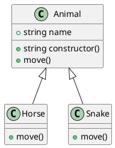

# Modeling

[](https://crates.io/crates/modeling)
[](https://docs.rs/modeling/)
[](https://github.com/inherd/modeling/blob/master/LICENSE)

> Modeling is a tools to analysis different languages by Ctags

process:

1. generate to opt
2. call `ctags` with opt
3. analysis ctags logs
4. output resulse

language support:

 - [x] Java
 - [x] C# (basic, not testing namespace)
 - [x] Cpp
 - [x] TypeScript
 - [x] Golang
 - [x] Rust (basic)

## Usage

### use binary

```
cargo install modeling
modeling .
```

### Library

```rust
use modeling::{by_dir};
use modeling::render::PlantUmlRender;

let classes = by_dir("src/");
let puml = PlantUmlRender::render(&classes);
```

output sample:



## Usage

- Modeling, create `model from source code by `ctags`.
- Concepting, generate concepts from method name & class name.
- Diffing, diff two different file.
- Graphing, generate `graphviz` and visual data.

## Samples

to image: `plantuml modeling.puml modeling.svg -tsvg`

### MVC only

```
modeling --input=/youpath/ --field-only --without-parent --grep ".*Service|.*Controller|.*Repository"
```

## with Graphviz


License
---

ctags analysis based on [https://github.com/dalance/ptags](https://github.com/dalance/ptags) with MIT, see in [src](plugins/coco_struct_analysis/src)

ctags parser rewrite from Golang's [https://github.com/ruben2020/tags2uml](https://github.com/ruben2020/tags2uml) with Apache License.

@ 2020~2021 This code is distributed under the MIT license. See `LICENSE` in this directory.
