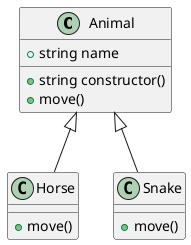

# Modeling

[](https://crates.io/crates/modeling)
[](https://docs.rs/modeling/)
[](https://github.com/inherd/modeling/blob/master/LICENSE)

> Modeling is a tools to analysis different languages by Ctags

process:

1. analysis `ctags`
  - generate to opt
  - call `ctags` with opt
  - analysis `ctags` logs by regex
2. generate results
3. visual result with `visualing` (optional)

language support:

 - [x] Java
 - [x] C#
 - [x] Cpp
 - [x] TypeScript
 - [x] Golang
 - [x] Rust
 - ... others by ctags

## Usage

 - modeling, generate model from source code.
 - concepting, generate concepts from source code.
 - visualing, visualization the uml.

```bash
Modeling 0.6.2

USAGE:
    modeling [FLAGS] [OPTIONS]

FLAGS:
    -b, --by-modules             multiple modules
    -d, --debug                  output debug information
    -f, --field-only             only load field in methods
    -h, --help                   Prints help information
        --inline-id-suffix       if class's prop end with Id and class in list, will replace `int` type to `xxClass`
    -m, --merge                  merge for same method name
    -V, --version                Prints version information
        --without-impl-suffix    if class's prop start with `IRepository` will become `Repository`
        --without-parent         without class inheritance

OPTIONS:
    -g, --grep <grep>                  by grep regex rules: for example: `.*Service` [default: ]
    -i, --input <input>                input dir [default: .]
    -o, --output-type <output-type>    support: puml, mermaid, graphviz with json [default: puml]
    -p, --packages <packages>...       filter by packages, like: `com.phodal.modeling`
    -s, --suffixes <suffixes>...       filter by suffixes, like: `java` for .java file
    --without-suffix-text <without-suffix-text>
        remove specify suffix by text, for example `DemoDto` with be `Demo` [default: ]
```

### sample: Grep with MVC

```bash
modeling --input=/youpath/ --field-only --without-parent --grep ".*Service|.*Controller|.*Repository"
```

### sample: with Graphviz and Visualization

with `--output-type=graphviz`

```bash
modeling --input=/youpath  --field-only -o graphviz --without-impl-suffix
```

### sample: puml to Image

convert to image: `plantuml modeling.puml modeling.svg -tsvg`

### with Visualization

PS: need to set `--output-type graphviz`, in order to generate `output.json` file

```bash
modeling -i youpath -o graphviz
visualing
```

## Library

```
cargo install modeling
modeling .
```

#### Library

```rust
use modeling::{by_dir};
use modeling::render::PlantUmlRender;

let classes = by_dir("src/");
let puml = PlantUmlRender::render(&classes);
```

output sample:



License
---

ctags analysis based on [https://github.com/dalance/ptags](https://github.com/dalance/ptags) with MIT, see in [src](plugins/coco_struct_analysis/src)

ctags parser rewrite from Golang's [https://github.com/ruben2020/tags2uml](https://github.com/ruben2020/tags2uml) with Apache License.

@ 2020~2021 This code is distributed under the MIT license. See `LICENSE` in this directory.
